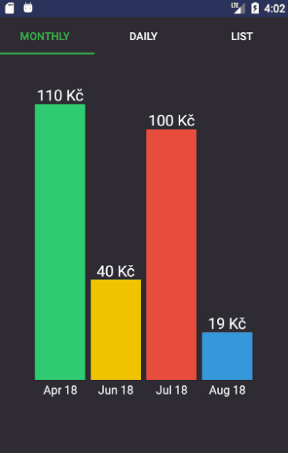

An android app for keeping track of monthly spending on public transport. Made for personal use to evaluate the cost savings of purchasing individual tickets vs a monthly pass.

Main activity contains buttons for quick adding of rides.

Settings activity for setting prices of local transport tickets and editing database records.

Statistics activity for displaying the monthly/daily stats.

## Running on your device

There is no signed apk release available. If you want to run the app you will need to build it yourself in Android Studio (https://developer.android.com/studio/publish) or run a development/debug version (https://developer.android.com/studio/run/device).
